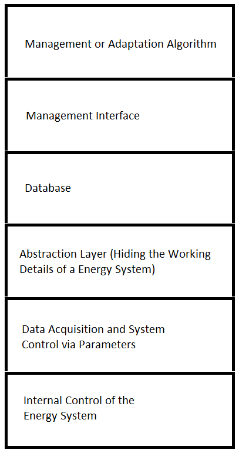
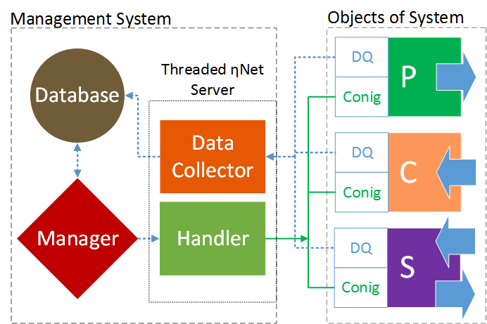
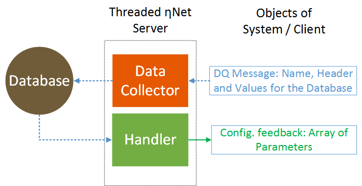
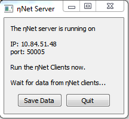

# ThreadedQtEtaNetServer
C++/Qt 5.8 - Threaded server that retrieves messages, writes them to SQLite DB, and returns the control parameters as feedback.

# Threaded ηNet Server - Networking of Cyber-Physical Objects (OPS) to Managing Energy Systems

## Context of the development
In the context of the ηNet energy management project a system was developed that allows the energetic analysis and the management of control of energy systems.The energy systems of the future will be a network of a multitude of technologies and applications. However, the diversity of these components, their topology and the size of the systems lead to a high degree of complexity. The energy systems of the future are confronted with serious problems for system stability and efficiency. The aim of the project is to develop a software and network system that abstracts and digitizes energy and information flows. This abstraction and digitization enables cross-system control.

OOP-oriented Programming Paradigm of the Management:
The control interface of the CPOs is summarized as a (control) matrix. If one of the parameters changes, this has a direct influence on the CPOs and therefore on the system itself.  

For example, self-organizing algorithms can use this control matrix:
* If a producer fails, another inactive producer can be switched on or energy consumers can be deactivated.  
* In order to save costs, low-cost producers can be prioritized higher.
* to save carbon dioxide, emission-free producers can be prisorized higher.
* etc.  

 Currently the demo versions of management interface and algorithms are under development and will follow soon...


## Concept of Energy Management System
The aim is to establish a management layer that has an influence on the control of the energy system. In this way, higher adaptation strategies can be implemented.



Figure1: Layered representation of the abstraction. 

For digitization, all field elements of the energy system are classified into three classes: producers, consumers and storages. Each real element is understood as a cyber-physical object (CPO) of these classes. This CPOs carry all values to fully describe and control the field elements of the energy system and serve as an interface for external applications. The real CPOs are generated by a single on-board computer on which the client software for the ηNet network also runs. Together with the ηNet-servers, it is possible to easily create a network with CPOs to collect all data and control the entire plant together with a database. Due to the CPOs, the management system knows all about existing system components and the networking. This knowledge base is used for plant-specific optimization or adaptation algorithms. For example, to minimize costs or CO2 emissions. This enables higher control strategies and data managed systems. 



Figure2: Schematic representation of the system architecture concept. Producer (P), Consumer (C), Storage (S), Data Acquisition (DQ), Controlling and Configuration (Conig). The big blue arrows indicate the direction of the energy flows.



Figure3: Schematic representation of the server workflow. 

## ηNet - Communication Protocol 

The clients can send a message at any time. No message is lost, because the server processes more or less in parallel all messages in a mulitaskting process.  The server is programmed so that only the communication line, the hardware of the computer and the database query limit the data traffic. 

### Data structure the server expects from the client:
```
"'NameOfClient' ( 'DBHeader 1', 'DBHeader 2', ..., 'DBHeader n') VALUES (value 1, value 2, ..., value n)"
If one of the values is a string then it should be quoted ( 'value 1' ).
```

Example:
```
"'CHP- SenerTec Dachs G5.52' ('Time Stamp - Heat Meter 1', 'Th. Power [W] - Heat Meter 1', 'Water Flow [m^3/h] - Heat Meter 1', 'T_Flow [°C] - Heat Meter 1', 'T_Return [°C] - Heat Meter 1', 'Time Stamp - Heat Meter 2', 'Th. Power [W] - Heat Meter 2', 'Water Flow [m^3/h] - Heat Meter 2', 'T_Flow [°C] - Heat Meter 2', 'T_Return [°C] - Heat Meter 2') VALUES ('2018-12-22 14:09:36', 12000.2, 12.1258, 22.14, 22.44, '2018-12-11 14:09:36', 12000.1, 11.1258, 21.14, 21.44)";
```
### Data structure the client expects from the server:
When the client sends measurement data or an 'E5', the server first checks whether any of the control data has changed. If none of the data has changed compared to the last call, the server sends back an 'E5' immediately afterwards. However, if one of the control data in the database has changed, the server returns the current set of control data from the client. 
The control data has the same data structure for each client. I.e. the headers in the database are the same for each client. While the client always sends the headers together with the measurement data, the server only sends an array of values to the client.
```
"'ControlMatrix' ('Object Name',  'Activity (on / off)', 'Prioritization', 'El. Power Limitation', 'Th. Power Limitation', 'Release Time', 'Operating Mode') VALUES ('Name of Client', 'None', 'None', 'None', 'None', 'None', 'None')";
```

For all control parameters of the clients only one table is stored in the database and automatically created at the beginning when the first message is received. 
```
In the above case, the client receives:
['None', 'None', 'None', 'None', 'None', 'None'], [NULL, NULL, NULL, NULL, NULL, NULL] or [0, 0, 0, 0, 0, 0,]

```
### All status messages:
From server to client: 
* 'E5': None of the disturbance parameters has changed.
* 'F6': Wrong messages from client. Data structure does not correspond to the protocol.
* 'F7': Database is not open or server can not open. 
* 'F8': Server gets no messages or message is empty 

From client to server:
* 'E5': Query whether the control parameters are still current, if not, the server sends the current data.
* Not yet implemented ('E6': Transmits current control parameters.)

## Prerequisites
For this project the toolkit with the Qt Creater 4.2.2 and Qt 5.8 MinGW 32 bit was used.
For beginners I recommend to lern more: [Getting started](http://doc.qt.io/qt-5/gettingstarted.html)

## Deployment and Starting ηNet Server
Currently only one executable file for Windows version higher than 7 is offered for download: 
* [Download the zip file](bin/EtaNetServerV0_9_2.zip)
* Unzip it
* Change to the desired IT network on your computer. The server automatically recognizes the assigned address and sets the port (50005).  
* Start (klick on) .exe file
* If every received set of measurement data from all connected clients is to be stored in the database, then press "Save data". If the button is not pressed, only the current measurement data for each connected client will be stored in the database. If a new file is received, the old one will be overwritten. 

## Instructions for Use ηNet Server
When the server is started, you can see the assigned IP and port. The database is automatically created in the background in the same directory as the exe file. To browse the database, the ["DB Browser for SQLite"](https://sqlitebrowser.org/) is recommended.
The server is programmed in such a way that it does not have to be in any special order for the connections with the client. As long as the clients adhere to the ηNet - Communication Protocol, everything should work as desired. But because the server is still under development (V0.9.1), bugs may occur. In such cases please contact us, so we can fix it right away. 



## System and Software Engineer, Project Supervisor and Author
Ferhat Aslan

## License
The Threaded Fortune Server Example from the Qt Network was used as inspiration.
This project is licensed under MIT - see the [LICENSE](LICENSE.md) file for details


